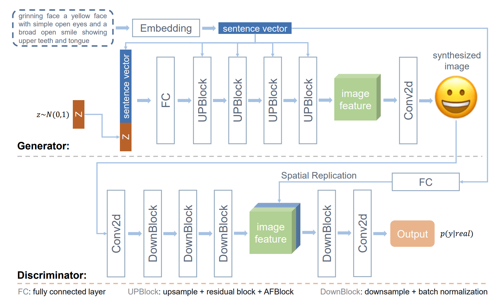
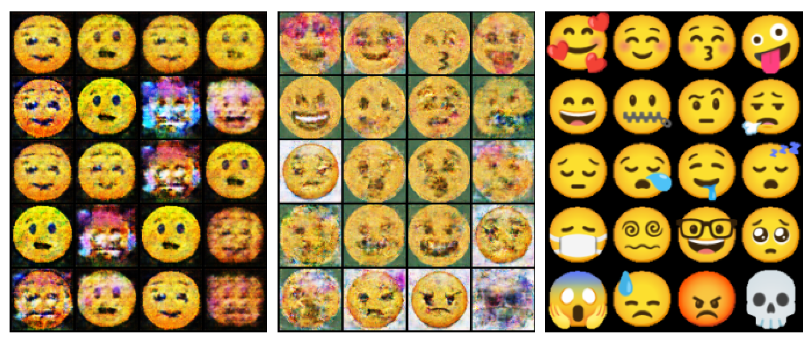

# Attentional Fusion Generative Adversarial Networks AFGAN

## Introduction
This is my final project of ''Machine Learning Practical Semster 2''. In this project, we build our own EmojiSet and propose a novel attentional fusion generative adversarial network (AF-GAN) for text-to-image synthesis. AF-GAN outperforms the model used in the previous emoji generation work and can produce more virtually identical eomjis. The architecture of the proposed AF-GAN for text-to-image synthesis is shown as below:

## Data Set
We build our own Text2Image data set named EmojiSet. This data set consists of 700 emoji images belonging to 100 different facial expressions. Each type of facial expression is provided with a sentence of text descriptions. The images in the data set comes from the the public [Full Emoji Database](https://www.kaggle.com/datasets/eliasdabbas/emoji-data-descriptions-codepoints) and we only select those facial emojis from them. The corresponding text descriptions are made based on the information given on the [emojipedia](https://emojipedia.org/people/) platform. We randomly select 80 different types of emojis (i.e. 560 images) for training and the left 20 categories are used for testing.

## Set Up
* Unzip the data set located in `./data/` named `emoji_faces.zip`.
* Download Google's pre-trained [Word2Vec](https://drive.google.com/file/d/0B7XkCwpI5KDYNlNUTTlSS21pQmM/edit?resourcekey=0-wjGZdNAUop6WykTtMip30g) model and put it under `./models/`.
* Install the required libraries with `./requirements.txt`.
* Run the script `./code/main.py` and he generated results will be svaed in `./figures/`.

## Results
I also implement the baseline model (DC-GAN) and its modified version which can be seen in ''CDGAN.py'' and ''UPGAN.py''. You can modified several lines of codes to run ablation experiments. I provide the generated emoji images by different models in `./figures/`. You can also run the code in `./code/utils.py` to compute corresponding metric scores (PSNR and SSIM), which will be stored in `./results`.

The left one is generated by
conditional DC-GAN, the middle one is produced by AF-GAN, the right one contains real emoji images.

## Acknowledgment
This project use the baseline model proposed by Radford et. al. [1](#R1) and Radpour et. al.[2](#R2). Our new module is proposed inspired by previous work of Eca-net [3](#R3) and Cbam[4](#R4).

## Main References

[1] Radford, Alec, Metz, Luke, and Chintala, Soumith. Unsupervised representation learning with deep convolutional generative adversarial networks. arXiv preprint arXiv:1511.06434,2015.

[2]Radpour, Dianna and Bheda, Vivek. Conditional generative adversarial networks for emoji synthesis with word embedding manipulation. arXiv preprint arXiv:1712.04421,2017.

[3]  Wang, Qilong, Wu, Banggu, Zhu, Pengfei, Li, Peihua, Zuo, Wangmeng, and Hu, Qinghua. Eca-net: Efficient channel attention for deep convolutional neural networks. In Proceedings of the IEEE/CVF conference on computer vision and pattern recognition, pp. 11534–11542, 2020.

[4]  Woo, Sanghyun, Park, Jongchan, Lee, Joon-Young, and Kweon, In So. Cbam: Convolutional block attention module. In Proceedings of the European conference on computer vision (ECCV), pp. 3–19, 2018.

